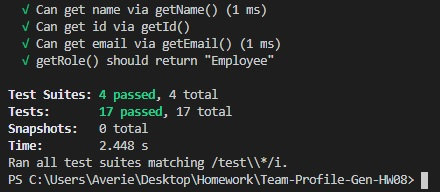
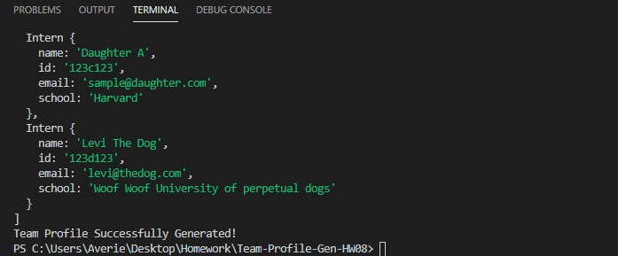
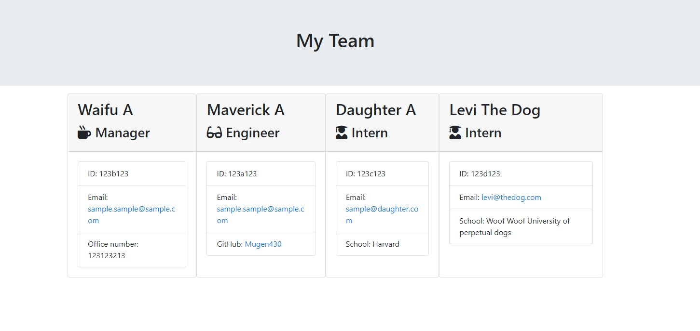

# Team Profile Generator Homework-10

# Necessary Installations to run app
Run "npm i" to run all necessary dependencies

# Description
The TPG is a terminal application that upon running the app.js on your terminal will initiate the app and prompts you with questions leading to your Team Profile info which then generates to an HTML file with the user input info as placed. 

## Screenshots Test - Console - Team Profile Generated

